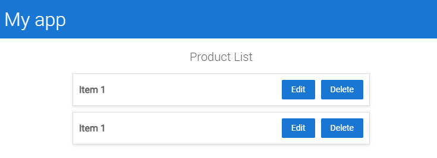

# Children, slots, content and projection
<br/>

Today I learn one interesting, which I didn't know before. 
I learned about ngContent, which is similar to children in React. 
Children are a way to pass elements to a component. No need to declare it, we just wrap it in the component.

<br/>


In Angular we have something called ng-content. If we need pass some customization, ngContent is the way to go.
I prepare some example, where I try to explain how it works. 


[Link to codesandbox](https://codesandbox.io/p/devbox/gallant-liskov-p7dy99?file=%2Fsrc%2Fapp%2Fcomponents%2Fproduct-list%2Fproduct-list.component.html%3A8%2C6)

<br/>


Lets imagine, we have items with similar structure, but we want to add some customization to each item.
Write different components? Use ifology? No. I am huge fan of render props pattern in React, so I am happy I can use similar thing in Angular.

<br/>

In my example we have list, where we want to add some customization to each item. Different color, different text, different icon.
Structure is very basic - usually to render list we should use loop or map, but I just want to show idea.
Code, without ng-content, would look like this:

<br />

List:

<br />

```html
<h2>Product List</h2>
<ul class="list-container">
<app-product-item></app-product-item>
<app-product-item></app-product-item>
</ul>
```

<br />

Item:

```html
<li class="list-item">
    <div class="list-content">
        <span class="item-name">Item 1</span>
        <div class="item-options">
            <button class="option-button">Edit</button>
            <button class="option-button">Delete</button>
        </div>
    </div>
</li>
```



<br/>

Ok, where is place for customization? Between tags

```html
<app-product-item>
    <span class="item-name">Customized text</span>
</app-product-item>
```

<br/>


But it won't work without special element in item component. This element is called ng-content.

<br/>

```html
<li class="list-item">
    <div class="list-content">
        <ng-content></ng-content>
        <div class="item-options">
            <button class="option-button">Edit</button>
            <button class="option-button">Delete</button>
        </div>
    </div>
</li>
```

Ok, but what if we neeed pass two or more components? Use two ng-content elements?
Not exactly. We have to distinguish them. We can use select attribute. Let say - we want to have
 custom elements on sides and in the middle we want to have default content.

<br/>

```html
<li class="list-item">
    <div class="list-content">
        <ng-content select="[first-element]"></ng-content>
        <span class="item-name">Item 1</span>
        <ng-content select="[second-element]"></ng-content>
    </div>
</li>
```

<br/>

and usage:

<br/>

```html
  <h2>Product List</h2>
<ul class="list-container">
<app-product-item></app-product-item>
<app-product-item>
    <div first-element>Hello</div>
    <div second-element>Welcome to the example</div>
</app-product-item>
</ul>
  ```


<br/>

Other useful cases? For example forms - In some forms inputs like Email and name can be always required,
but sometimes we need to add some additional fields.

<br/>

I think ng-content is very useful and allow us to write more reusable components.
